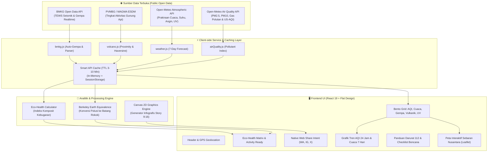

# 🌿 Sekitarku (Environmental & Disaster Intelligence Platform)

> **Platform Pemantauan Kualitas Lingkungan Hidup, Polusi Udara, Cuaca, Seismik BMKG, dan Status Gunung Api PVMBG Terpadu di Indonesia.**

---

## 📌 Ringkasan Sistem (System Overview)

**Sekitarku** adalah platform analitik lingkungan dan keselamatan publik berbasis web modern (PWA) yang dirancang untuk memberikan transparansi data kualitas udara, cuaca, kegempaan, serta aktivitas vulkanologi secara *real-time* kepada masyarakat di seluruh 38 provinsi Indonesia.

Mengintegrasikan data terbuka resmi dari **Badan Meteorologi, Klimatologi, dan Geofisika (BMKG)**, **PVMBG / MAGMA Indonesia (Badan Geologi - Kementerian ESDM)**, serta pemodelan atmosfer global dari **Open-Meteo**, Sekitarku memproses jutaan titik data atmosfer dan geofisika menjadi rekomendasi keselamatan yang praktis dan langsung dapat ditindaklanjuti.

---

## 🏛️ Arsitektur Sistem & Aliran Data (Data Flow)

---

## 🌟 Modul & Fitur Unggulan

### 1. Skor Kesehatan Lingkungan Komposit (Eco-Health Composite Score)
- Menggabungkan 5 parameter krusial: **Indeks Polusi Udara (AQI US-EPA)**, **Konsentrasi PM2.5**, **Suhu Terasa (Apparent Temperature)**, **Kelembapan Relatif**, dan **Tingkat Radiasi Sinar UV**.
- Memberikan skor 0–100 dengan status instan (*Sangat Sehat*, *Cukup Baik*, *Waspada Polusi/Panas*, *Berbahaya*).
- **Matriks Kesiapan Aktivitas Luar Ruangan**: Rekomendasi kesiapan untuk *Olahraga/Jogging*, *Aktivitas Anak & Lansia*, *Keringat/Dehidrasi*, serta anjuran *Ventilasi Rumah*.
- **Konversi Bahaya Polusi Berkeley Earth**: Menghitung estimasi bahaya hirupan partikulat harian yang setara dengan hisapan rokok pasif (misal: *Setara ~2.4 batang rokok/hari*).

### 2. Pemantauan Polusi Udara Lengkap & Skala Spektrum AQI (0–500)
- Standar klasifikasi **US-EPA AQI** (0–500) dengan spektrum warna visual kontinu dan **Jarum Penanda Posisi Dinamis (*Needle Indicator*)** yang bergerak ke persentase nilai AQI aktual.
- Rincian polutan mikro: **PM2.5**, **PM10**, **Karbon Monoksida (CO)**, **Nitrogen Dioksida (NO2)**, **Sulfur Dioksida (SO2)**, **Ozon Permukaan (O3)**, dan **Partikel Debu**.
- Grafik historis tren fluktuasi AQI per jam untuk membaca pola puncak polusi harian.

### 3. Pemantauan Aktivitas Gunung Api PVMBG / MAGMA Indonesia
- **Deteksi Jarak Gunung Api Terdekat (*Proximity Intelligence*)**: Menghitung jarak ke kawah gunung api terdekat secara otomatis berdasarkan kota/koordinat GPS pengguna via *Haversine formula*.
- **Status 4 Level Resmi PVMBG**: Menampilkan tingkat aktivitas vulkanik (*Level I Normal, Level II Waspada, Level III Siaga, Level IV Awas*) lengkap dengan radius steril kawah dan panduan abu vulkanik.
- **Direktori Gunung Api Indonesia**: Modal pencarian dan filter status seluruh gunung api aktif di Nusantara.

### 4. Sistem Peringatan Dini Seismik BMKG (Earthquake & Tsunami Alert)
- **Auto-Gempa Real-Time**: Terhubung langsung ke *BMKG Indonesia Tsunami Early Warning System (InaTEWS)* untuk mendeteksi gempa bumi terkini dalam hitungan detik.
- Rincian parameter seismik: Magnitudo, Kedalaman, Koordinat Lintang/Bujur, Wilayah Episentrum, Skala Intensitas MMI yang dirasakan, dan Status Potensi Tsunami.
- Visualisasi peta guncangan mikro (*Shakemap raster*) resmi dari BMKG dan riwayat 15 gempa bumi terkini.

### 5. Prakiraan Cuaca 7 Hari & Indeks UV Ekstrem
- Suhu saat ini, suhu terasa (*feels-like*), persentase kelembapan, tekanan udara permukaan, kecepatan dan arah angin.
- Grafik prakiraan cuaca komprehensif 7 hari ke depan lengkap dengan rentang suhu min/max dan probabilitas hujan.
- Pengukur indeks radiasi Ultraviolet (UV) matahari disertai waktu aman terpapar dan anjuran penggunaan tabir surya (*sunscreen*).

### 6. Peta Geospasial Interaktif Nusantara (Leaflet Multi-Layer)
- Menampilkan seluruh stasiun pantau kota, titik episentrum gempa bumi, serta **titik gunung api aktif** dengan radius bahaya kawah.
- Dilengkapi kontrol layer interaktif `🌋 Gunung Api (ON/OFF)`.

### 7. Panduan Tanggap Darurat & Kontak Darurat 112 Indonesia
- Akses cepat tombol darurat **Call 112** (Layanan Panggilan Darurat Nasional Indonesia).
- Panduan protokol keselamatan komprehensif berdasarkan standar BNPB & BPBD:
  - 🚨 **Protokol Gempa Bumi** (Drop, Cover, Hold On, Evakuasi)
  - 🌊 **Protokol Tsunami** (Evakuasi 20-20-20)
  - 🌋 **Protokol Erupsi Gunung Api & Hujan Abu**
  - 🌧️ **Protokol Banjir & Cuaca Ekstrem**
  - 😷 **Protokol Polusi Udara Ekstrem & Kabut Asap**
- Direktori kontak penting: **Basarnas (115)**, **Ambulans (118/119)**, **Pemadam Kebakaran (113)**, **Kepolisian (110)**, dan **PLN (123)**.

### 8. Generator Kartu Infografis & Native Intent Share
- Menghasilkan kartu infografis resolusi tinggi (rasio 9:16 HD) yang digambar secara presisi via **HTML5 Canvas 2D** dengan proteksi pembatasan teks agar tidak tumpuk/keluar kotak.
- **1-Tap Direct Web Share API**: Terintegrasi langsung dengan *Native Share Sheet* smartphone (*Android / iOS*) untuk membagikan gambar laporan langsung ke **WhatsApp Status/Story**, **Instagram Stories**, **Twitter/X**, Telegram, atau Direct Message.

### 9. Cakupan 500+ Kota & Kabupaten di Seluruh Indonesia
- Mendukung pencarian instan seluruh kota dan kabupaten di 38 provinsi Indonesia.
- Filter navigasi berdasarkan wilayah kepulauan: *Jawa, Sumatera, Kalimantan, Sulawesi, Bali & Nusa Tenggara, Maluku & Papua*.
- Deteksi lokasi otomatis berbasis **HTML5 GPS Geolocation**.

### 10. Progressive Web App (PWA) & Web Push Notifications
- Instalasi satu klik langsung ke layar utama (*Home Screen*) perangkat smartphone Android, iOS, dan Desktop.
- Dukungan *Web Push Notification* untuk peringatan polusi udara tidak sehat (AQI > 150) dan gempa bumi signifikan (M >= 5.5).

---

## ⚡ Rekayasa Kinerja & Optimasi (Performance Engineering)

Sistem Sekitarku dirancang dengan standar performa tinggi untuk memastikan pengalaman akses instan dan mulus:

| Aspek Optimasi | Implementasi Teknis | Dampak Kinerja |
| :--- | :--- | :--- |
| **Code Splitting** | `React.lazy()` + Dynamic Import untuk modal & visualisasi berat | Mengurangi ukuran bundle inisial JavaScript dari **848 kB** menjadi **103 kB** (**-88%**) |
| **Vendor Isolation** | `manualChunks` di Rollup/Vite untuk Leaflet, Recharts, React, dan Lucide | Cache browser vendor independen jangka panjang (*long-term cacheability*) |
| **Smart API Caching** | In-Memory `Map` + `sessionStorage` dengan TTL (3-10 menit) | Navigasi antar kota instan (**0ms**) & bebas batas kuota API |
| **Network Prefetching** | DNS Prefetch & Preconnect untuk server data BMKG, Open-Meteo, & Map Tiles | Menghemat *Time-to-First-Byte (TTFB)* dan latensi SSL handshake |
| **DOM Containment** | `overscroll-behavior: contain` pada modal & CSS hardware acceleration | Menghilangkan *layout thrashing* dan scroll-bounce di peramban mobile |

---

## 🛡️ Standar Keamanan & Ketahanan (Security Hardening)

- **Content Security Policy (CSP) Ketat**: Membatasi eksekusi skrip, stylesheet, aset visual, dan koneksi API hanya pada sumber terverifikasi resmi (*BMKG, Open-Meteo, Google Fonts, OpenStreetMap*).
- **Enterprise Security Headers**: Dilengkapi `X-Frame-Options: DENY` (perlindungan anti-clickjacking), `X-Content-Type-Options: nosniff` (anti MIME sniffing), dan `Referrer-Policy: strict-origin-when-cross-origin`.
- **Sanitasi Rel Links**: Seluruh tautan eksternal menggunakan `target="_blank" rel="noopener noreferrer"` untuk mencegah kerentanan eksploitasi tabnabbing.
- **Defensive Error Handling**: Mekanisme fallback *stale-while-revalidate* yang tangguh agar antarmuka pengguna tidak mengalami *crash* saat server data BMKG / Open-Meteo sedang dalam pemeliharaan.

---

## 🛠️ Tumpukan Teknologi (Tech Stack)

- **Framework**: [React 19](https://react.dev/) + [Vite 8](https://vitejs.dev/) (Fast Client-Side Build Tool)
- **Styling**: Vanilla CSS (Custom Flat Design Tokens, High-Contrast Palette, Zero CSS Bloat)
- **Pemetaan**: [Leaflet 1.9.4](https://leafletjs.com/) + [React-Leaflet 5](https://react-leaflet.js.org/)
- **Visualisasi Data**: [Recharts 3.10](https://recharts.org/)
- **Ikonografi**: [Lucide React](https://lucide.dev/)
- **Manipulasi Waktu**: [date-fns](https://date-fns.org/)
- **Sumber Data Terbuka**:
  - BMKG Indonesia Open Data (TEWS Seismik & Gempaterkini)
  - PVMBG / MAGMA Indonesia (Pusat Vulkanologi & Mitigasi Bencana Geologi - Badan Geologi ESDM)
  - Open-Meteo Weather & Air Quality API

---

## 📄 Lisensi (License)

Proyek ini dirilis di bawah lisensi terbuka [MIT License](LICENSE). Bebas digunakan, dipelajari, dan dikembangkan untuk kepentingan publik dan kemanusiaan.